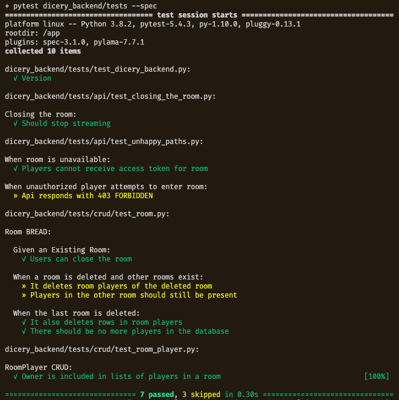

# Dicery (Backend API)

    
    

<em>
Dicery is a dice-rolling app where a group of friends can create their own room, roll the dice, and have their dice results broadcasted to everyone in the same room. 
</em>

    

    Frontend Github Repository: <a href="https://github.com/paxcodes/dicery_app">paxcodes/dicery_app</a>

Built with <a href="https://github.com/tiangolo/fastapi">FastAPI</a> | Deployed in an AWS EC2 instance using principles in <a href="https://dockerswarm.rocks/">dockerswarm.rocks</a> |   CI/CD using <a href="https://buddy.works">buddy.works</a>

## About

The API receives requests to:

- create a room
- add members to a room
- close a room
- broadcast dice results to users subscribed in a room using Server-Sent Events

## Development

To setup a development environment:

1. Install [Docker](https://www.docker.com/)
2. Navigate to the project's root directory / the directory where docker-compose files are located
3. Run `docker-compose up`

### Tests

To run tests,

1. Initially, run: `DOMAIN=backend sh ./scripts/test-local.sh`
2. For subsequent tests, run `docker-compose exec backend /app/tests-start.sh`

You can pass pytest arguments at the end of the previous command. E.g. 

`DOMAIN=backend sh ./scripts/test-local.sh -k test_it_also_deletes_rows_in_room_players`

`docker-compose exec backend /app/tests-start.sh -k test_it_also_deletes_rows_in_room_players`

## License
See LICENSE file in this repo. 😄
